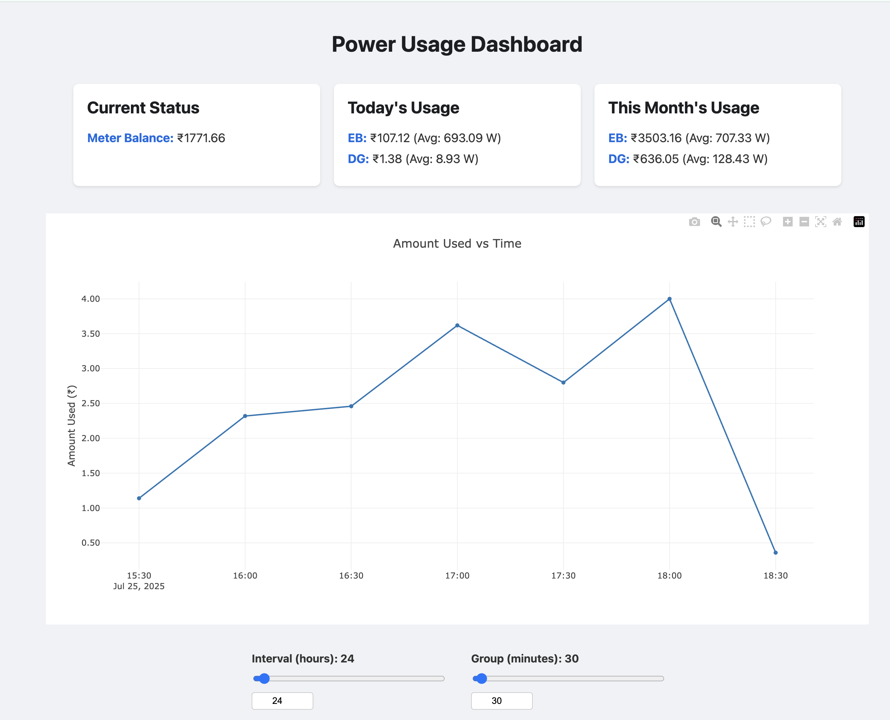

# Power Usage Tracker

A Flask-based web application to track and visualize your power usage data from your electricity provider. 

This solution is specifically targeted for ELNET Power meters typically used in Indian Gated communities. I created this because, the app is slow, buggy and doesnt let me slice and dice the data as I need to. 

The application provides a dashboard to view your power consumption over time and sends you Telegram notifications for daily summaries, low balance alerts, and power source changes.

## Features

- **Dashboard:** A web-based dashboard to visualize your power usage data with interactive graphs, recent recharge history, and a real-time power source indicator.
- **Telegram Notifications:** Get real-time notifications for:
    - Daily power usage summaries.
    - Low meter balance alerts.
    - Power source changes (e.g., switching on and off of DG).
    - Meter recharge notifications.
- **Enhanced DG Detection:** Smart detection of DG power changes that handles stale data from the server.
- **Meter Recharge Tracking:** Automatic detection and tracking of meter recharges with detailed history.
- **Docker Support:** The application can be easily deployed using Docker and Docker Compose.

### Screenshot



*Note: The screenshot may be slightly outdated. The power source indicator is now located in the "Current Status" card.*

## Prerequisites

Before you begin, ensure you have the following installed:

- [Python 3.8+](https://www.python.org/downloads/)
- [pip](https://pip.pypa.io/en/stable/installation/)
- [Docker](https://docs.docker.com/get-docker/) (optional, for Docker-based setup)
- [Docker Compose](https://docs.docker.com/compose/install/) (optional, for Docker-based setup)

You will also need a Telegram bot and your chat ID. You can get these by talking to the [BotFather](https://t.me/botfather) on Telegram.

## Installation

### 1. Clone the Repository

```bash
git clone https://github.com/your-username/power-usage-tracker.git
cd power-usage-tracker
```

### 2. Create the Environment File

Create a `.env` file by copying the `.env.example`:

```bash
cp .env.example .env
```

Now, open the `.env` file and fill in the required values:

- `LIVE_UPDATES_API_URL`: The URL for the live updates API.
- `HOME_DATA_API_URL`: The URL for the home data API.
- `LOW_BALANCE_THRESHOLD`: The balance threshold for low balance alerts.
- `POWER_USAGE_BEARER_TOKEN`: Your bearer token for API authentication.
- `TELEGRAM_BOT_TOKEN`: Your Telegram bot token.
- `TELEGRAM_CHAT_ID`: Your Telegram chat ID.

### 3. Install Dependencies

```bash
pip install -r requirements.txt
```

### 4. Run the Application

```bash
flask run
```

The application will be available at `http://127.0.0.1:5000`.

## Docker Setup

You can also run the application using Docker and Docker Compose.

### 1. Build and Run the Container

```bash
docker-compose up --build
```

The application will be available at `http://127.0.0.1:5000`.

## Configuration

The application is configured using environment variables. You can find all the configurable variables in the `.env.example` file.

| Variable | Description |
| --- | --- |
| `LIVE_UPDATES_API_URL` | The URL for the live updates API. |
| `HOME_DATA_API_URL` | The URL for the home data API. |
| `LOW_BALANCE_THRESHOLD` | The balance threshold for low balance alerts. |
| `POWER_USAGE_BEARER_TOKEN` | Your bearer token for API authentication. |
| `POWER_USAGE_DATABASE` | The name of the database file (optional, defaults to `power_usage_index.db`). |
| `POWER_USAGE_FETCH_INTERVAL_SECONDS` | The interval in seconds to fetch data from the API (optional, defaults to 30). |
| `TELEGRAM_BOT_TOKEN` | Your Telegram bot token. |
| `TELEGRAM_CHAT_ID` | Your Telegram chat ID. |

## Usage

Once the application is running, you can access the dashboard at `http://127.0.0.1:5000`. The dashboard displays your power usage data in an interactive graph. You can customize the graph using the following controls:

- **Interval (hours):** This slider allows you to select the time interval for the data displayed on the graph. You can view data for the last 1 to 720 hours (30 days).
- **Group (minutes):** This slider allows you to group the data points on the graph by the specified number of minutes. This is useful for smoothing out the graph and viewing trends over a longer period.

You will also receive Telegram notifications for:

- **Daily Summary:** A summary of your daily power usage, sent at 11:59 PM every day.
- **Low-Balance Alert:** An alert when your meter balance falls below the configured threshold.
- **DG Alert:** An alert when the power source switches to the DG. When switching back to EB, a summary of the DG session is provided, including duration, amount used, and average power consumption.
- **Meter Recharge Alert:** An alert when your meter is recharged with the amount added and new balance.

The dashboard now also displays:
- **Power Source Indicator:** A real-time indicator in the "Current Status" card shows whether you are on EB or DG power and for how long.
- **Recent Recharges:** Shows the last 5 meter recharges with dates and amounts.
- **Enhanced DG Detection:** More accurate detection of DG power changes that ignores stale server data.
- **Meter Recharge Tracking:** Automatic tracking of all meter recharges in the database.

## API

This application is designed to work with the ELNET Power meter APIs. Here are the sample responses expected from the APIs:

### GetLiveUpdates API

This API provides live data about your power consumption. The default endpoint is `http://<your-elnet-server-ip>:<port>/api/Dashboard/GetLiveUpdates`.

```json
{
    "Status": "Success",
    "Message": "Data Available",
    "Data": {
        "Supply": 0,
        "PresentLoad": 0.58,
        "Balance": 1787.42,
        "EB": 48808.72,
        "DG": 477.24,
        "SanctionEB": 52.0,
        "SanctionDG": 52.0,
        "UpdatedOn": "25-07-2025 15:56:59",
        "Solar": 0.0
    }
}
```

### HomeData API

This API provides summary data for the current day and month. The default endpoint is `http://<your-elnet-server-ip>:<port>/api/Dashboard/HomeData`.

```json
{
    "Status": "Success",
    "Message": "Data Available",
    "Data": {
        "DeviceId": 454,
        "kWhRecToday": 10.96,
        "kvahRecToday": 0.0,
        "kWhDelToday": 0.06,
        "SolarToday": 0.0,
        "kvahDelToday": 0.0,
        "kWhRecMonth": 418.65,
        "kvahRecMonth": 0.0,
        "kWhDelMonth": 28.91,
        "SolarMonth": 0.0,
        "kvahDelMonth": 0.0,
        "MeterBal": 1787.5,
        "RelStatus": "ON",
        "EBDGStatus": 0,
        "kwh_kvah_Status": 0,
        "CurrentDay_EB": 91.3,
        "CurrentDay_DG": 1.38,
        "CurrentDay_Solar": 0.0,
        "FixedChargesToday": 0.0,
        "CurrentMonth_EB": 3487.34,
        "CurrentMonth_DG": 636.05,
        "CurrentMonth_Solar": 0.0,
        "FixedChargesMonth": 0.0,
        "Meter_SN": "1124094",
        "IsCoilEnable": false,
        "IsEB": true,
        "IsDG": true,
        "IsSolar": false,
        "IsFixedCharge": false
    }
}
```